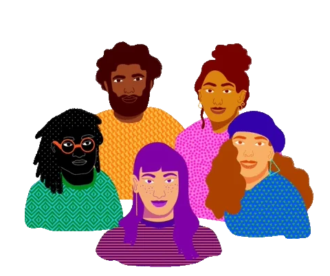

<!-- Introduction -->
## **Hi there 👋, I'm Maaz Ahmed 💻**

A software engineer who uses React, Angular, and NextJs technology to create full-stack mobile and web applications. I've finished a lot of tasks as training. Moreover, I'm learning react-native and web 3 to develop more exciting stuff.

Rather than relying solely on technical solutions, I prefer to examine the challenges pre/post-development through problem-solving. I use cutting-edge techniques and methods for better user experience and scalability.

- 🔭 I’m currently working on React and Next Js
- 🌱 I’m currently learning Web3
- 👯 I’m looking to collaborate on web projects (MERN/MEAN Stack)

<!-- Skils -->
##  Skills 🚀

     
     
     
     
     

  

<!-- Contributions -->
## 🐍 GitHub Contribution 

<!-- Widget box -->

<!-- Snake animation -->
<picture>
  <source media="(prefers-color-scheme: dark)" srcset="https://raw.githubusercontent.com/maazakn/maazakn/dist/github-snake-dark.svg" />
  <source media="(prefers-color-scheme: light)" srcset="https://raw.githubusercontent.com/maazakn/maazakn/dist/github-snake.svg" />
  
</picture>

<!-- Trophies -->
## 🏆 GitHub Trophies

  

<!-- Socials -->
## 🌐 How to reach mee

  
 <em><b>I love connecting with different people</b> so if you want to say <b>hi, I'll be happy to meet you more!</b> :blush:</em>
  
 
 
 
 

